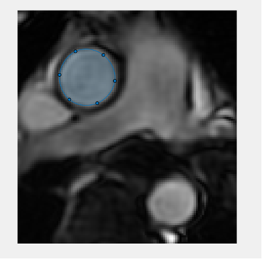

# PWV_QA

MATLAB based scripts for semi-automated 2D image segmentation and Pulse Wave Velocity (PWV) calculation using the Flow-Area (QA) method. See below paper for more details on the QA method.

>Vulliémoz S, Stergiopulos N, Meuli R. Estimation of local aortic elastic properties with MRI. Magn Reson Med. 2002 Apr;47(4):649-54. doi: 10.1002/mrm.10100. PMID: 11948725.

For instructions on how to use these scripts, see the included Word document.

test
